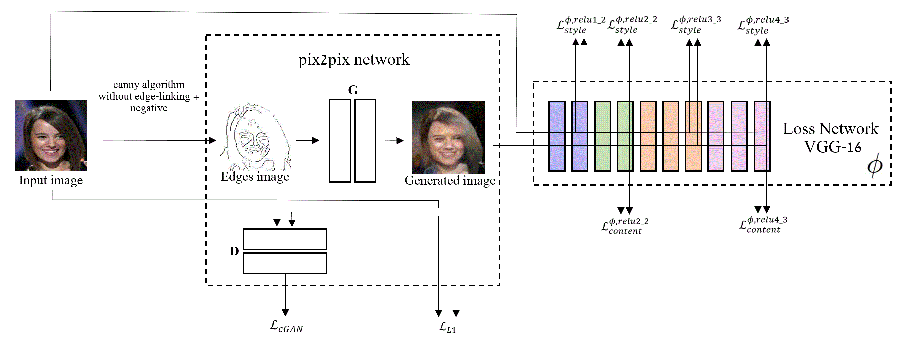

# PortraitPainting2RealImage


We propose a new approach for generating realistic images out of portrait painting.

Our idea is:

1)extract the edges out of an image - using canny algorithm (without the edge-linking step)

2)create negative out of the picture

3)run our pix2pix with perceptual loss pretrained model

# Instructions
## Installation
- Clone this repo:
```bash
git clone https://github.com/PetruninAlex/PortraitPainting2RealImage.git
cd PortraitPainting2RealImage
```
## Test our model
- Download our model from google drive (needs gdown): 
```bash
pip install gdown
bash download_model.sh
TODO
```
- Test our model:
```bash
python test_model.py --dir /path/To/Images
TODO
```
## Train your own model
- Prepare your data set for training:
```bash
python prepare_dataset.py --contentDir /path/To/Images --destDir /path/To/Save 
```
- Train a model:
```bash
python train.py --dataroot /path/To/Data --name your_name_to_model --model pix2pix --direction BtoA
```
- Test the model:
```bash
python test.py --dataroot /path/To/Data --name your_name_to_model --model pix2pix --direction BtoA
```
for more useful information about the training and testing pix2pix network [click here](https://github.com/junyanz/pytorch-CycleGAN-and-pix2pix/blob/master/docs/tips.md)
# Acknowledgments
We used pix2pix network from here: https://github.com/junyanz/pytorch-CycleGAN-and-pix2pix

The inspiration to the perceptual loss came from this article: https://arxiv.org/abs/1603.08155

The code for the perceptual loss came from here: https://github.com/pytorch/examples/tree/master/fast_neural_style

The code for the edge extraction came from here: https://github.com/rishimukherjee/Canny-Python/blob/master/canny-slow.py 


