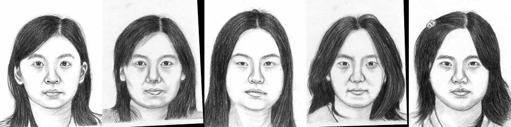

# Sketch2Real


We propose a new approach for generating realistic images out of a sketch drawing.

Our idea is:

1)Extract the edges out of a sketch drawing.

2)Run pix2pix model with added perceptual loss term.

# Instructions
## Installation
- Clone this repo:
```bash
git clone https://github.com/PetruninAlex/Sketch2Real.git
cd Sketch2Real
```
## Test our pre-trained model
- Download weights from google drive (needs gdown): 
```bash
pip install gdown
bash download_model.sh
```
- Test our pre-trained model:
```bash
python test_model.py --dir /path/To/Images/Folder
```
- Check your results here: ./results/best_model/test_latest/images/
## Train your own model
- Prepare your dataset for training:

It will extract edges from the images in the folder, and prepare the folder to pix2pix training.
```bash
python prepare_dataset.py --contentDir /path/To/Images/Folder --destDir /path/To/Save 
```
- You can use `—-trainRatio, —-testRatio, —-valRatio` to change the ratios. 
- The default is: `--trainRatio = 0.7, —-testRatio = 0.15, —-valRatio = 0.15`.
- Train a model:
```bash
python train.py --dataroot /path/To/Data --name your_name_to_model --model pix2pix --direction BtoA --lambda_L1 lambda_l1 --lambda_content_low lambda_content_low --lambda_content_deep lambda_content_deep --lambda_style lambda_style
```
- The default and the best results were achieved using: `--lambda_L1 = 100, --lambda_content_low = 100, --lambda_content_deep = 0, --lambda_style = 0`
- Test the model:
```bash
python test.py --dataroot /path/To/Data --name your_name_to_model --model pix2pix --direction BtoA
```
for more useful information about the training and testing pix2pix network [click here](https://github.com/junyanz/pytorch-CycleGAN-and-pix2pix/blob/master/docs/tips.md)
# Acknowledgments
We used the pix2pix network from here: https://github.com/junyanz/pytorch-CycleGAN-and-pix2pix

The inspiration to the perceptual loss came from this article: https://arxiv.org/abs/1603.08155

The code for the perceptual loss came from here: https://github.com/pytorch/examples/tree/master/fast_neural_style

The code for the edge extraction came from here: https://github.com/rishimukherjee/Canny-Python/blob/master/canny-slow.py

(Note: though the README file states the implementation is not finished, it actually is)

We used this data set for sketches: http://mmlab.ie.cuhk.edu.hk/archive/facesketch.html

We used this data set for training: http://mmlab.ie.cuhk.edu.hk/projects/CelebA.html
